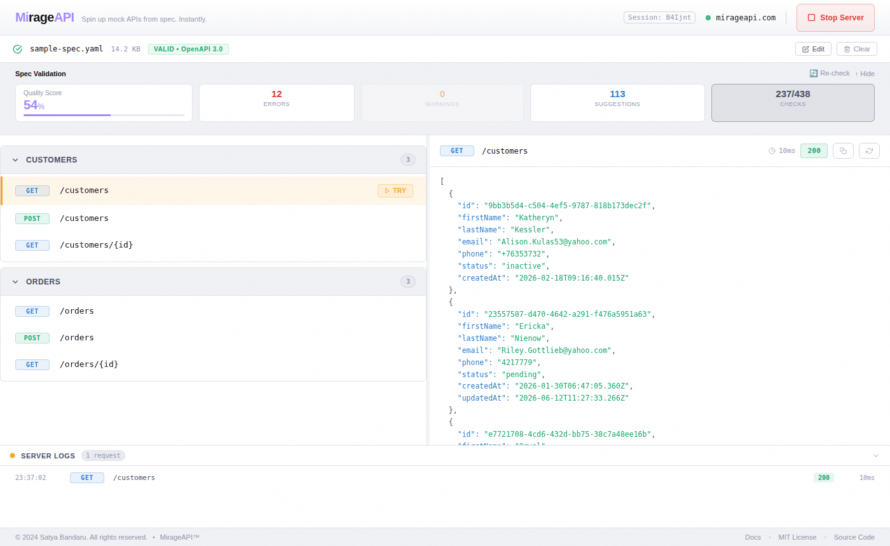

<div align="center">

# MirageAPI

**Instant mock servers from any OpenAPI spec.**

Drop in an OpenAPI or Swagger file and every endpoint is live in seconds, returning fresh, constraint-aware data on every call. No signup, no install, no hand-written stubs.

[](https://mirageapi.com/app/)
[](https://mirageapi.com/docs/)
[](LICENSE)


[**Launch the app**](https://mirageapi.com/app/) · [Documentation](https://mirageapi.com/docs/) · [Guides](https://mirageapi.com/guides/) · [Compare](https://mirageapi.com/compare/)



<sub>The demo spec intentionally contains issues so you can see the spec quality report in action.</sub>

</div>

## Why MirageAPI?

You're building against an API that doesn't exist yet, or one you can't reach from your dev environment because of security or compliance rules. Existing mock tools make you install something, hand-write stubs, or maintain response templates.

MirageAPI treats your OpenAPI spec as the source of truth:

- **Zero setup:** upload or paste a spec in the browser and click Start Server.
- **Realistic, schema-valid data:** UUIDs are UUIDs, emails are emails, a `firstName` is a real first name, enums pick real values, numbers stay in range.
- **Fresh data on every call,** so your UI is tested against varied lengths, sizes and missing optional fields.
- **Share it:** one click gives you a public mock URL your team, frontend or CI can call.
- **Test the unhappy paths:** force status codes, add latency, and get a `400` when a request breaks the contract.
- **Runs locally too:** the same engine is a Node.js CLI for frontend development and CI.

## Quick start

### In the browser (no install)

1. Open **[mirageapi.com/app](https://mirageapi.com/app/)**.
2. Upload, paste or load your spec from a URL, or click **Load demo**.
3. Click **Start Server** and call any endpoint from the built-in request tester.
4. Click **Share** for a public URL like `https://mirageapi.com/m/Ab3dE7xY` that anyone can call.

### Locally with the CLI

Requires Node.js 18+.

```bash
git clone https://github.com/venkatbandaru99/mirage.git
cd mirage
yarn install

node src/index.js --spec ./examples/sample-spec.yaml --port 3000
```

```text
✓ Spec loaded and validated successfully
Mirage mock server running on http://localhost:3000
📋 Endpoints:
   GET /customers
   POST /customers
   GET /customers/{id}
   GET /orders
   POST /orders
   GET /orders/{id}
```

```bash
curl http://localhost:3000/customers
curl http://localhost:3000/orders/ba7c859d-8a94-4044-abfa-2d6986a14936
curl "http://localhost:3000/customers?__status=500&__delay=800"   # simulate an error and latency
curl -X POST http://localhost:3000/customers \
  -H "Content-Type: application/json" \
  -d '{"firstName":"Ada","lastName":"Lovelace","email":"ada@example.com"}'
```

| Option | Description |
|---|---|
| `-s, --spec <file>` | OpenAPI spec (JSON or YAML). Required. |
| `-p, --port <number>` | Port to listen on (default `3000`) |
| `--no-validate` | Accept requests that don't match the spec (validation is on by default) |
| `--quiet` | Suppress the startup banner |
| `-w, --web` | Run the full web app instead (see [Development](#development)) |

## Features

- ✅ OpenAPI **3.0, 3.1** and Swagger **2.0**, JSON or YAML, from a file, paste or public URL, validated before anything goes live
- ✅ **Constraint-aware generation:** `format` (email, uuid, date, date-time, uri, …), `enum`, `minimum`/`maximum`, `minLength`/`maxLength`, `pattern`, `minItems`/`maxItems`
- ✅ **Field-name-aware data:** `firstName`, `email`, `phone`, `city`, `country`, `postalCode`, `productName`, `company`, `…Id` and more get realistic values, always within the field's constraints
- ✅ Nested objects, arrays, `allOf`, `oneOf` and `anyOf`
- ✅ `POST`/`PUT`/`PATCH` echo the request body back with a generated `id`
- ✅ **Shareable mock URLs:** `mirageapi.com/m/<id>/...`, callable by anyone for 7 days
- ✅ **Request validation:** path, query and JSON body checked against the spec, with a `400` listing each problem
- ✅ **Simulation:** force any status code (`?__status=404`, `Prefer: code=404`) or add latency (`?__delay=800`)
- ✅ **Spec examples on request** (`Prefer: example` or `?__example=true`); generated data stays the default
- ✅ Spec quality report with a quality score, errors, warnings and suggestions
- ✅ Request logging, plus built-in `/_mirage/health` and `/_mirage/routes`
- ✅ CORS enabled, so a frontend on another port can call the mock directly

See exactly how each schema rule maps to generated data in the **[docs](https://mirageapi.com/docs/#data-generation)**.

## How it compares

| | MirageAPI | Prism | Mockoon | WireMock |
|---|---|---|---|---|
| Runs in the browser, no install | ✅ | ❌ | ❌ | ❌ |
| Mocks every endpoint from an OpenAPI spec automatically | ✅ | ✅ | Via import | Via WireMock Cloud |
| Fresh generated data on every call | ✅ | Dynamic mode | Templates | Templates |
| Request validation | ✅ | ✅ | ❌ | Matching rules |
| Status and latency simulation | ✅ | Status only | ✅ | ✅ |
| Free public mock URL | ✅ | ❌ | Paid cloud | Paid cloud |
| Stateful mocks | Planned | ❌ | ✅ | ✅ |

Honest, detailed comparisons: [vs Prism](https://mirageapi.com/compare/prism/) · [vs Mockoon](https://mirageapi.com/compare/mockoon/) · [vs WireMock](https://mirageapi.com/compare/wiremock/)

## Roadmap

- [x] Use `example` values from the spec when present
- [x] Field-name-aware data (`firstName` → a real first name, `city` → a real city)
- [x] Shareable public mock URLs
- [x] Request validation against the spec
- [x] Status code and latency simulation
- [ ] Shared links that survive server restarts (Redis)
- [ ] Stateful CRUD mode
- [ ] Publish to npm (`npx mirageapi --spec openapi.yaml`)

Have an idea? [Open an issue](https://github.com/venkatbandaru99/mirage/issues).

## Development

```bash
yarn install

yarn dev          # CLI mock server with the sample spec on :3001
SESSION_SECRET=dev yarn dev:web   # web app: API on :3001 + Vite on :5173/app/
yarn test         # test suite (node --test)
yarn build        # React app → dist/app/, static site → dist/
SESSION_SECRET=dev yarn start:web # serve the built site and app on :3001
```

### Project structure

```
mirage/
├── src/
│   ├── index.js          # CLI entry point
│   ├── parser.js         # OpenAPI spec parser
│   ├── generator.js      # Constraint-aware data generator
│   ├── validator.js      # Spec quality checks
│   ├── request-validator.js  # Validates mock requests against the spec
│   ├── share-store.js    # In-memory shared mock links (7-day expiry)
│   ├── safe-fetch.js     # Loads specs from URLs without reaching internal hosts
│   └── server.js         # Express mock server + web routes
├── client/app/           # React web app (served at /app/)
├── site/                 # Static website: landing, docs, guides, comparisons
│   ├── build.js          # Renders site/pages/* to dist/ + sitemap.xml
│   ├── layout.js         # Shared <head>, nav and footer
│   └── pages/            # One module per page (add new pages here)
├── test/                 # node --test suites and fixtures
├── examples/
│   └── sample-spec.yaml  # Sample customer/order API
└── package.json
```

`yarn build` runs Vite (the React app → `dist/app/`) and then `site/build.js`, which writes the landing page, `/docs/`, `/guides/*`, `/compare/*`, `404.html` and `sitemap.xml` to `dist/`. To add a page, create a module in `site/pages/` and add it to `PAGES` in `site/build.js`; it's added to the sitemap automatically.

### Deploying

The hosted site runs on [Railway](https://railway.app). Connect the repo, set a `SESSION_SECRET` environment variable, and Railway runs `yarn build` and `yarn start:prod` (see `railway.json` and `nixpacks.toml`).

### Tech stack

Node.js · Express · React + Vite · [@apidevtools/swagger-parser](https://github.com/APIDevTools/swagger-parser) · [@faker-js/faker](https://fakerjs.dev/) · commander

## Contributing

Contributions are welcome! See [CONTRIBUTING.md](CONTRIBUTING.md) for guidelines.

## License

MirageAPI is licensed under the [MIT License](LICENSE). Copyright (c) 2024 Satya Bandaru.

"MirageAPI" is a trademark of Satya Bandaru. The open-source license does not grant rights to use the trademark; see [BRAND_GUIDELINES.md](BRAND_GUIDELINES.md).
